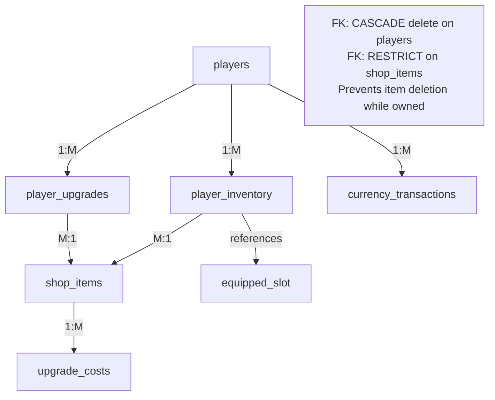

# Shop & Upgrade System - Complete Database Design

## Overview
Comprehensive shop/upgrade system for Turn-Based Game with currency management, equipment upgrades, and inventory tracking. Designed for MySQL/TiDB compatibility with full migration support.

---

## 1. Database Schema Design

### 1.1 Core Tables

#### **`players` Table (MODIFIED)**
Extended existing players table with currency fields.

```sql
ALTER TABLE players ADD COLUMN IF NOT EXISTS (
    coins INT UNSIGNED NOT NULL DEFAULT 1000 COMMENT 'Soft currency (earned in-game)',
    gems INT UNSIGNED NOT NULL DEFAULT 100 COMMENT 'Premium currency (bought with real money)',
    created_at TIMESTAMP NOT NULL DEFAULT CURRENT_TIMESTAMP,
    updated_at TIMESTAMP NOT NULL DEFAULT CURRENT_TIMESTAMP ON UPDATE CURRENT_TIMESTAMP,
    KEY idx_coins (coins),
    KEY idx_gems (gems)
) ENGINE=InnoDB DEFAULT CHARSET=utf8mb4 COLLATE=utf8mb4_unicode_ci;
```

**Fields:**
- `coins`: Soft currency earned from battles/achievements
- `gems`: Premium currency for rare items/battle pass
- `created_at`: Account creation timestamp
- `updated_at`: Last profile modification time

---

#### **`shop_items` Table**
Master table defining all purchasable items in the shop.

```sql
CREATE TABLE IF NOT EXISTS shop_items (
    item_id INT UNSIGNED PRIMARY KEY AUTO_INCREMENT COMMENT 'Unique item identifier',
    item_name VARCHAR(100) NOT NULL UNIQUE COMMENT 'Display name (e.g., "Iron Sword")',
    item_type ENUM('weapon', 'armor', 'accessory', 'consumable') NOT NULL COMMENT 'Equipment slot type',
    description TEXT COMMENT 'Item description and effects',
    base_stat_boost INT UNSIGNED NOT NULL DEFAULT 0 COMMENT 'Base bonus (attack/defense/hp)',
    stat_type ENUM('attack', 'defense', 'hp') NOT NULL COMMENT 'Stat modified by this item',
    base_cost_coins INT UNSIGNED NOT NULL COMMENT 'Price in soft currency',
    base_cost_gems INT UNSIGNED NOT NULL DEFAULT 0 COMMENT 'Price in premium currency (0 = coins only)',
    rarity ENUM('common', 'uncommon', 'rare', 'epic', 'legendary') NOT NULL DEFAULT 'common',
    is_upgradeable BOOLEAN NOT NULL DEFAULT TRUE COMMENT 'Can be leveled up',
    max_level INT UNSIGNED NOT NULL DEFAULT 5 COMMENT 'Maximum upgrade level',
    icon_url VARCHAR(255) COMMENT 'URL to item icon',
    is_active BOOLEAN NOT NULL DEFAULT TRUE,
    created_at TIMESTAMP NOT NULL DEFAULT CURRENT_TIMESTAMP,
    updated_at TIMESTAMP NOT NULL DEFAULT CURRENT_TIMESTAMP ON UPDATE CURRENT_TIMESTAMP,
    
    KEY idx_item_type (item_type),
    KEY idx_rarity (rarity),
    KEY idx_stat_type (stat_type),
    KEY idx_is_active (is_active)
) ENGINE=InnoDB DEFAULT CHARSET=utf8mb4 COLLATE=utf8mb4_unicode_ci
COMMENT='Master table of all shop items';
```

**Fields:**
- `item_id`: Primary key
- `item_type`: Categorizes items (weapon/armor/etc.)
- `stat_type`: Which stat this item boosts
- `is_upgradeable`: Whether item levels can be increased
- `max_level`: Level cap (default 5 levels)
- `rarity`: Visual/pricing tier for items

---

#### **`player_inventory` Table**
Tracks what items each player owns.

```sql
CREATE TABLE IF NOT EXISTS player_inventory (
    inventory_id INT UNSIGNED PRIMARY KEY AUTO_INCREMENT,
    player_id INT UNSIGNED NOT NULL,
    item_id INT UNSIGNED NOT NULL,
    current_level INT UNSIGNED NOT NULL DEFAULT 1 COMMENT 'Current upgrade level (1 to max_level)',
    quantity INT UNSIGNED NOT NULL DEFAULT 1 COMMENT 'Stack count (for consumables)',
    is_equipped BOOLEAN NOT NULL DEFAULT FALSE COMMENT 'Whether item is active in a slot',
    equipped_slot ENUM('weapon', 'armor', 'accessory') COMMENT 'Which equipment slot (NULL if not equipped)',
    acquired_date TIMESTAMP NOT NULL DEFAULT CURRENT_TIMESTAMP,
    last_upgraded TIMESTAMP NULL COMMENT 'When last upgraded',
    
    CONSTRAINT fk_inventory_player FOREIGN KEY (player_id) 
        REFERENCES players(id) ON DELETE CASCADE,
    CONSTRAINT fk_inventory_item FOREIGN KEY (item_id) 
        REFERENCES shop_items(item_id) ON DELETE RESTRICT,
    
    UNIQUE KEY uk_player_item_slot (player_id, item_id, equipped_slot),
    KEY idx_player_id (player_id),
    KEY idx_item_id (item_id),
    KEY idx_is_equipped (is_equipped),
    KEY idx_acquired_date (acquired_date)
) ENGINE=InnoDB DEFAULT CHARSET=utf8mb4 COLLATE=utf8mb4_unicode_ci
COMMENT='Player inventory and equipped items';
```

**Fields:**
- `current_level`: Upgrade progress (1 = base item)
- `is_equipped`: Currently active in character build
- `equipped_slot`: Which slot this item fills
- `last_upgraded`: Track when upgrade occurred

**Constraints:**
- Foreign key to players (CASCADE delete)
- Foreign key to shop_items (RESTRICT delete - prevents item deletion while owned)
- Unique constraint: Player can have one item per equipped slot

---

#### **`player_upgrades` Table**
Tracks upgrade progression and costs.

```sql
CREATE TABLE IF NOT EXISTS player_upgrades (
    upgrade_id INT UNSIGNED PRIMARY KEY AUTO_INCREMENT,
    player_id INT UNSIGNED NOT NULL,
    item_id INT UNSIGNED NOT NULL,
    from_level INT UNSIGNED NOT NULL COMMENT 'Starting upgrade level',
    to_level INT UNSIGNED NOT NULL COMMENT 'Target upgrade level',
    cost_coins INT UNSIGNED NOT NULL DEFAULT 0 COMMENT 'Coins spent',
    cost_gems INT UNSIGNED NOT NULL DEFAULT 0 COMMENT 'Gems spent',
    upgraded_at TIMESTAMP NOT NULL DEFAULT CURRENT_TIMESTAMP,
    
    CONSTRAINT fk_upgrades_player FOREIGN KEY (player_id) 
        REFERENCES players(id) ON DELETE CASCADE,
    CONSTRAINT fk_upgrades_item FOREIGN KEY (item_id) 
        REFERENCES shop_items(item_id) ON DELETE RESTRICT,
    
    KEY idx_player_id (player_id),
    KEY idx_item_id (item_id),
    KEY idx_upgraded_at (upgraded_at)
) ENGINE=InnoDB DEFAULT CHARSET=utf8mb4 COLLATE=utf8mb4_unicode_ci
COMMENT='Audit log of all player upgrades';
```

**Fields:**
- Immutable record of each upgrade transaction
- Tracks both coins and gems spent
- Useful for analytics, rollback, and player history

---

#### **`upgrade_costs` Table (OPTIONAL BUT RECOMMENDED)**
Define upgrade costs per level.

```sql
CREATE TABLE IF NOT EXISTS upgrade_costs (
    cost_id INT UNSIGNED PRIMARY KEY AUTO_INCREMENT,
    item_id INT UNSIGNED NOT NULL,
    from_level INT UNSIGNED NOT NULL COMMENT 'Upgrade FROM this level',
    to_level INT UNSIGNED NOT NULL COMMENT 'Upgrade TO this level',
    cost_coins INT UNSIGNED NOT NULL,
    cost_gems INT UNSIGNED NOT NULL DEFAULT 0,
    stat_bonus_per_level FLOAT UNSIGNED NOT NULL DEFAULT 5.0 COMMENT 'Stat increase multiplier',
    
    CONSTRAINT fk_upgrade_costs_item FOREIGN KEY (item_id) 
        REFERENCES shop_items(item_id) ON DELETE CASCADE,
    
    UNIQUE KEY uk_item_level_transition (item_id, from_level, to_level),
    KEY idx_item_id (item_id)
) ENGINE=InnoDB DEFAULT CHARSET=utf8mb4 COLLATE=utf8mb4_unicode_ci
COMMENT='Upgrade cost matrix per item and level';
```

**Example data:**
- Iron Sword level 1→2: 100 coins, +5 attack
- Iron Sword level 2→3: 200 coins, +5 attack
- Iron Sword level 5→Max: 500 coins + 10 gems, +5 attack

---

#### **`currency_transactions` Table (AUDIT)**
Track all currency changes for anti-cheat and analytics.

```sql
CREATE TABLE IF NOT EXISTS currency_transactions (
    transaction_id INT UNSIGNED PRIMARY KEY AUTO_INCREMENT,
    player_id INT UNSIGNED NOT NULL,
    transaction_type ENUM(
        'purchase', 'upgrade', 'reward', 'refund', 'shop_purchase',
        'battle_reward', 'admin_adjustment'
    ) NOT NULL,
    coins_change INT NOT NULL DEFAULT 0 COMMENT 'Positive/negative amount',
    gems_change INT NOT NULL DEFAULT 0,
    reason VARCHAR(255) NOT NULL,
    reference_id INT UNSIGNED COMMENT 'Links to inventory_id or upgrade_id',
    created_at TIMESTAMP NOT NULL DEFAULT CURRENT_TIMESTAMP,
    
    CONSTRAINT fk_transaction_player FOREIGN KEY (player_id) 
        REFERENCES players(id) ON DELETE CASCADE,
    
    KEY idx_player_id (player_id),
    KEY idx_transaction_type (transaction_type),
    KEY idx_created_at (created_at)
) ENGINE=InnoDB DEFAULT CHARSET=utf8mb4 COLLATE=utf8mb4_unicode_ci
COMMENT='Immutable audit log of currency changes';
```

---

### 1.2 Complete SQL Schema File

```sql
-- ============================================================================
-- TURN-BASED GAME: SHOP & UPGRADE SYSTEM SCHEMA
-- Database: TiDB/MySQL 8.0+
-- Version: 1.0
-- ============================================================================

-- Set encoding for proper character support
SET NAMES utf8mb4;
SET CHARACTER SET utf8mb4;

-- ============================================================================
-- PHASE 1: ALTER EXISTING TABLES
-- ============================================================================

-- Extend players table with currency
ALTER TABLE players ADD COLUMN IF NOT EXISTS coins INT UNSIGNED NOT NULL DEFAULT 1000 AFTER password_hash;
ALTER TABLE players ADD COLUMN IF NOT EXISTS gems INT UNSIGNED NOT NULL DEFAULT 100 AFTER coins;
ALTER TABLE players ADD COLUMN IF NOT EXISTS created_at TIMESTAMP NOT NULL DEFAULT CURRENT_TIMESTAMP AFTER gems;
ALTER TABLE players ADD COLUMN IF NOT EXISTS updated_at TIMESTAMP NOT NULL DEFAULT CURRENT_TIMESTAMP ON UPDATE CURRENT_TIMESTAMP AFTER created_at;

-- Add indexes for performance
ALTER TABLE players ADD KEY IF NOT EXISTS idx_coins (coins);
ALTER TABLE players ADD KEY IF NOT EXISTS idx_gems (gems);

-- ============================================================================
-- PHASE 2: CREATE NEW TABLES
-- ============================================================================

-- Master items table
CREATE TABLE IF NOT EXISTS shop_items (
    item_id INT UNSIGNED PRIMARY KEY AUTO_INCREMENT,
    item_name VARCHAR(100) NOT NULL UNIQUE,
    item_type ENUM('weapon', 'armor', 'accessory', 'consumable') NOT NULL,
    description TEXT,
    base_stat_boost INT UNSIGNED NOT NULL DEFAULT 0,
    stat_type ENUM('attack', 'defense', 'hp') NOT NULL,
    base_cost_coins INT UNSIGNED NOT NULL,
    base_cost_gems INT UNSIGNED NOT NULL DEFAULT 0,
    rarity ENUM('common', 'uncommon', 'rare', 'epic', 'legendary') NOT NULL DEFAULT 'common',
    is_upgradeable BOOLEAN NOT NULL DEFAULT TRUE,
    max_level INT UNSIGNED NOT NULL DEFAULT 5,
    icon_url VARCHAR(255),
    is_active BOOLEAN NOT NULL DEFAULT TRUE,
    created_at TIMESTAMP NOT NULL DEFAULT CURRENT_TIMESTAMP,
    updated_at TIMESTAMP NOT NULL DEFAULT CURRENT_TIMESTAMP ON UPDATE CURRENT_TIMESTAMP,
    
    KEY idx_item_type (item_type),
    KEY idx_rarity (rarity),
    KEY idx_stat_type (stat_type),
    KEY idx_is_active (is_active)
) ENGINE=InnoDB DEFAULT CHARSET=utf8mb4 COLLATE=utf8mb4_unicode_ci;

-- Player inventory table
CREATE TABLE IF NOT EXISTS player_inventory (
    inventory_id INT UNSIGNED PRIMARY KEY AUTO_INCREMENT,
    player_id INT UNSIGNED NOT NULL,
    item_id INT UNSIGNED NOT NULL,
    current_level INT UNSIGNED NOT NULL DEFAULT 1,
    quantity INT UNSIGNED NOT NULL DEFAULT 1,
    is_equipped BOOLEAN NOT NULL DEFAULT FALSE,
    equipped_slot ENUM('weapon', 'armor', 'accessory'),
    acquired_date TIMESTAMP NOT NULL DEFAULT CURRENT_TIMESTAMP,
    last_upgraded TIMESTAMP NULL,
    
    CONSTRAINT fk_inventory_player FOREIGN KEY (player_id) 
        REFERENCES players(id) ON DELETE CASCADE,
    CONSTRAINT fk_inventory_item FOREIGN KEY (item_id) 
        REFERENCES shop_items(item_id) ON DELETE RESTRICT,
    
    UNIQUE KEY uk_player_item_slot (player_id, item_id, equipped_slot),
    KEY idx_player_id (player_id),
    KEY idx_item_id (item_id),
    KEY idx_is_equipped (is_equipped),
    KEY idx_acquired_date (acquired_date)
) ENGINE=InnoDB DEFAULT CHARSET=utf8mb4 COLLATE=utf8mb4_unicode_ci;

-- Upgrade audit log
CREATE TABLE IF NOT EXISTS player_upgrades (
    upgrade_id INT UNSIGNED PRIMARY KEY AUTO_INCREMENT,
    player_id INT UNSIGNED NOT NULL,
    item_id INT UNSIGNED NOT NULL,
    from_level INT UNSIGNED NOT NULL,
    to_level INT UNSIGNED NOT NULL,
    cost_coins INT UNSIGNED NOT NULL DEFAULT 0,
    cost_gems INT UNSIGNED NOT NULL DEFAULT 0,
    upgraded_at TIMESTAMP NOT NULL DEFAULT CURRENT_TIMESTAMP,
    
    CONSTRAINT fk_upgrades_player FOREIGN KEY (player_id) 
        REFERENCES players(id) ON DELETE CASCADE,
    CONSTRAINT fk_upgrades_item FOREIGN KEY (item_id) 
        REFERENCES shop_items(item_id) ON DELETE RESTRICT,
    
    KEY idx_player_id (player_id),
    KEY idx_item_id (item_id),
    KEY idx_upgraded_at (upgraded_at)
) ENGINE=InnoDB DEFAULT CHARSET=utf8mb4 COLLATE=utf8mb4_unicode_ci;

-- Upgrade cost matrix
CREATE TABLE IF NOT EXISTS upgrade_costs (
    cost_id INT UNSIGNED PRIMARY KEY AUTO_INCREMENT,
    item_id INT UNSIGNED NOT NULL,
    from_level INT UNSIGNED NOT NULL,
    to_level INT UNSIGNED NOT NULL,
    cost_coins INT UNSIGNED NOT NULL,
    cost_gems INT UNSIGNED NOT NULL DEFAULT 0,
    stat_bonus_per_level FLOAT UNSIGNED NOT NULL DEFAULT 5.0,
    
    CONSTRAINT fk_upgrade_costs_item FOREIGN KEY (item_id) 
        REFERENCES shop_items(item_id) ON DELETE CASCADE,
    
    UNIQUE KEY uk_item_level_transition (item_id, from_level, to_level),
    KEY idx_item_id (item_id)
) ENGINE=InnoDB DEFAULT CHARSET=utf8mb4 COLLATE=utf8mb4_unicode_ci;

-- Currency transaction audit
CREATE TABLE IF NOT EXISTS currency_transactions (
    transaction_id INT UNSIGNED PRIMARY KEY AUTO_INCREMENT,
    player_id INT UNSIGNED NOT NULL,
    transaction_type ENUM(
        'purchase', 'upgrade', 'reward', 'refund', 'shop_purchase',
        'battle_reward', 'admin_adjustment'
    ) NOT NULL,
    coins_change INT NOT NULL DEFAULT 0,
    gems_change INT NOT NULL DEFAULT 0,
    reason VARCHAR(255) NOT NULL,
    reference_id INT UNSIGNED,
    created_at TIMESTAMP NOT NULL DEFAULT CURRENT_TIMESTAMP,
    
    CONSTRAINT fk_transaction_player FOREIGN KEY (player_id) 
        REFERENCES players(id) ON DELETE CASCADE,
    
    KEY idx_player_id (player_id),
    KEY idx_transaction_type (transaction_type),
    KEY idx_created_at (created_at)
) ENGINE=InnoDB DEFAULT CHARSET=utf8mb4 COLLATE=utf8mb4_unicode_ci;

-- Add comments for documentation
ALTER TABLE shop_items COMMENT='Master catalog of all purchasable items';
ALTER TABLE player_inventory COMMENT='Players inventory and equipped items';
ALTER TABLE player_upgrades COMMENT='Audit log of upgrade transactions';
ALTER TABLE upgrade_costs COMMENT='Upgrade cost matrix';
ALTER TABLE currency_transactions COMMENT='Currency transaction audit log';
```

---

## 2. Data Relationships & Constraints



**Key Constraints:**
1. **Foreign Keys**: Ensure referential integrity
   - `player_inventory.player_id` → `players.id` (CASCADE)
   - `player_inventory.item_id` → `shop_items.item_id` (RESTRICT)
   - `player_upgrades.player_id` → `players.id` (CASCADE)
   - `currency_transactions.player_id` → `players.id` (CASCADE)

2. **Unique Constraints**:
   - `uk_player_item_slot`: Player can only equip ONE item per slot
   - `uk_item_level_transition`: Define costs once per level change

3. **Check Constraints**:
   - `current_level` ≤ `max_level` (enforce in application)
   - `to_level` > `from_level` in upgrades (enforce in application)

---

## 3. Migration Guide

### 3.1 Pre-Migration Checklist

```sql
-- 1. Backup existing database
-- Command: mysqldump -u user -p database_name > backup.sql

-- 2. Verify existing schema
DESCRIBE players;
DESCRIBE player_stats;

-- 3. Check for sufficient disk space
SELECT table_schema, SUM(data_length + index_length) / (1024*1024) AS size_mb
FROM information_schema.tables
GROUP BY table_schema;
```

### 3.2 Step-by-Step Migration

**Stage 1: Backup & Verification**
```sql
-- Create backup copies of existing tables
CREATE TABLE players_backup LIKE players;
INSERT INTO players_backup SELECT * FROM players;

CREATE TABLE player_stats_backup LIKE player_stats;
INSERT INTO player_stats_backup SELECT * FROM player_stats;
```

**Stage 2: Alter Existing Tables**
```sql
-- Add currency columns to players table
ALTER TABLE players 
ADD COLUMN coins INT UNSIGNED NOT NULL DEFAULT 1000 AFTER password_hash,
ADD COLUMN gems INT UNSIGNED NOT NULL DEFAULT 100 AFTER coins,
ADD COLUMN created_at TIMESTAMP NOT NULL DEFAULT CURRENT_TIMESTAMP AFTER gems,
ADD COLUMN updated_at TIMESTAMP NOT NULL DEFAULT CURRENT_TIMESTAMP ON UPDATE CURRENT_TIMESTAMP AFTER created_at;

-- Add indexes
ALTER TABLE players ADD KEY idx_coins (coins);
ALTER TABLE players ADD KEY idx_gems (gems);

-- Verify
SELECT * FROM players LIMIT 1;
```

**Stage 3: Create New Tables**
Execute the complete SQL schema file above.

```sql
-- Verify all new tables exist
SELECT table_name FROM information_schema.tables 
WHERE table_schema = DATABASE() 
ORDER BY table_name;
```

**Stage 4: Initialize Shop Items**
```sql
-- Run sample data insertion (see section 4 below)
```

**Stage 5: Validation**
```sql
-- Verify relationships
SELECT * FROM shop_items;
SELECT * FROM player_inventory;
SELECT * FROM player_upgrades;
SELECT * FROM currency_transactions;

-- Test foreign keys
INSERT INTO player_inventory (player_id, item_id) VALUES (1, 1);
-- Should fail if player or item doesn't exist

-- Rollback if needed
-- ROLLBACK;
```

---

## 4. Sample Data Insertion

### 4.1 Initialize Shop Items

```sql
-- ============================================================================
-- INSERT SAMPLE SHOP ITEMS
-- ============================================================================

-- WEAPONS
INSERT INTO shop_items (item_name, item_type, description, base_stat_boost, stat_type, base_cost_coins, rarity, is_upgradeable, max_level)
VALUES 
('Iron Sword', 'weapon', 'Basic iron blade. Grants +10 attack per level.', 10, 'attack', 100, 'common', TRUE, 5),
('Steel Blade', 'weapon', 'Stronger steel construction. Grants +15 attack per level.', 15, 'attack', 250, 'uncommon', TRUE, 5),
('Enchanted Claymore', 'weapon', 'Magical weapon with ice enchantment. Grants +25 attack per level.', 25, 'attack', 500, 'rare', TRUE, 5),
('Dragon Slayer', 'weapon', 'Legendary weapon forged in dragon fire. Grants +50 attack per level.', 50, 'attack', 1000, 'epic', TRUE, 5),
('Sword of Legends', 'weapon', 'Ultimate weapon of the ancients. Grants +100 attack per level.', 100, 'attack', 5000, 'legendary', TRUE, 10);

-- ARMOR
INSERT INTO shop_items (item_name, item_type, description, base_stat_boost, stat_type, base_cost_coins, rarity, is_upgradeable, max_level)
VALUES 
('Leather Armor', 'armor', 'Basic leather protection. Grants +10 defense per level.', 10, 'defense', 100, 'common', TRUE, 5),
('Iron Mail', 'armor', 'Steel plated armor. Grants +15 defense per level.', 15, 'defense', 250, 'uncommon', TRUE, 5),
('Mithril Plate', 'armor', 'Mythical metal armor. Grants +30 defense per level.', 30, 'defense', 500, 'rare', TRUE, 5),
('Dragon Scale Armor', 'armor', 'Impenetrable dragon scales. Grants +60 defense per level.', 60, 'defense', 1000, 'epic', TRUE, 5),
('Aegis of the Gods', 'armor', 'Divine protection. Grants +120 defense per level.', 120, 'defense', 5000, 'legendary', TRUE, 10);

-- ACCESSORIES
INSERT INTO shop_items (item_name, item_type, description, base_stat_boost, stat_type, base_cost_coins, rarity, is_upgradeable, max_level)
VALUES 
('Health Amulet', 'accessory', 'Restores vitality. Grants +20 HP per level.', 20, 'hp', 150, 'common', TRUE, 5),
('Guardian Ring', 'accessory', 'Protective band. Grants +40 HP per level.', 40, 'hp', 350, 'uncommon', TRUE, 5),
('Phoenix Talisman', 'accessory', 'Ancient talisman of rebirth. Grants +80 HP per level.', 80, 'hp', 600, 'rare', TRUE, 5),
('Immortal Crown', 'accessory', 'Crown of eternal life. Grants +150 HP per level.', 150, 'hp', 1200, 'epic', TRUE, 5),
('Heart of the Universe', 'accessory', 'Cosmic artifact. Grants +300 HP per level.', 300, 'hp', 5000, 'legendary', TRUE, 10);

-- Verify insertion
SELECT COUNT(*) AS total_items FROM shop_items;
SELECT item_name, rarity, base_cost_coins, max_level FROM shop_items ORDER BY base_cost_coins;
```

### 4.2 Initialize Upgrade Costs

```sql
-- ============================================================================
-- INSERT UPGRADE COST MATRIX
-- ============================================================================

-- Iron Sword upgrades
INSERT INTO upgrade_costs (item_id, from_level, to_level, cost_coins, cost_gems, stat_bonus_per_level)
VALUES 
((SELECT item_id FROM shop_items WHERE item_name = 'Iron Sword'), 1, 2, 100, 0, 10),
((SELECT item_id FROM shop_items WHERE item_name = 'Iron Sword'), 2, 3, 200, 0, 10),
((SELECT item_id FROM shop_items WHERE item_name = 'Iron Sword'), 3, 4, 300, 0, 10),
((SELECT item_id FROM shop_items WHERE item_name = 'Iron Sword'), 4, 5, 400, 5, 10);

-- Steel Blade upgrades
INSERT INTO upgrade_costs (item_id, from_level, to_level, cost_coins, cost_gems, stat_bonus_per_level)
VALUES 
((SELECT item_id FROM shop_items WHERE item_name = 'Steel Blade'), 1, 2, 200, 0, 15),
((SELECT item_id FROM shop_items WHERE item_name = 'Steel Blade'), 2, 3, 400, 0, 15),
((SELECT item_id FROM shop_items WHERE item_name = 'Steel Blade'), 3, 4, 600, 0, 15),
((SELECT item_id FROM shop_items WHERE item_name = 'Steel Blade'), 4, 5, 800, 5, 15);

-- Enchanted Claymore upgrades (costs more, better rewards)
INSERT INTO upgrade_costs (item_id, from_level, to_level, cost_coins, cost_gems, stat_bonus_per_level)
VALUES 
((SELECT item_id FROM shop_items WHERE item_name = 'Enchanted Claymore'), 1, 2, 400, 0, 25),
((SELECT item_id FROM shop_items WHERE item_name = 'Enchanted Claymore'), 2, 3, 800, 0, 25),
((SELECT item_id FROM shop_items WHERE item_name = 'Enchanted Claymore'), 3, 4, 1200, 5, 25),
((SELECT item_id FROM shop_items WHERE item_name = 'Enchanted Claymore'), 4, 5, 1600, 10, 25);

-- Legendary items (highest cost)
INSERT INTO upgrade_costs (item_id, from_level, to_level, cost_coins, cost_gems, stat_bonus_per_level)
VALUES 
((SELECT item_id FROM shop_items WHERE item_name = 'Sword of Legends'), 1, 2, 2000, 20, 100),
((SELECT item_id FROM shop_items WHERE item_name = 'Sword of Legends'), 2, 3, 3000, 30, 100),
((SELECT item_id FROM shop_items WHERE item_name = 'Sword of Legends'), 3, 4, 4000, 40, 100),
((SELECT item_id FROM shop_items WHERE item_name = 'Sword of Legends'), 4, 5, 5000, 50, 100),
((SELECT item_id FROM shop_items WHERE item_name = 'Sword of Legends'), 5, 6, 6000, 60, 100),
((SELECT item_id FROM shop_items WHERE item_name = 'Sword of Legends'), 6, 7, 7000, 70, 100),
((SELECT item_id FROM shop_items WHERE item_name = 'Sword of Legends'), 7, 8, 8000, 80, 100),
((SELECT item_id FROM shop_items WHERE item_name = 'Sword of Legends'), 8, 9, 9000, 90, 100),
((SELECT item_id FROM shop_items WHERE item_name = 'Sword of Legends'), 9, 10, 10000, 100, 100);

-- Health Amulet upgrades
INSERT INTO upgrade_costs (item_id, from_level, to_level, cost_coins, cost_gems, stat_bonus_per_level)
VALUES 
((SELECT item_id FROM shop_items WHERE item_name = 'Health Amulet'), 1, 2, 150, 0, 20),
((SELECT item_id FROM shop_items WHERE item_name = 'Health Amulet'), 2, 3, 300, 0, 20),
((SELECT item_id FROM shop_items WHERE item_name = 'Health Amulet'), 3, 4, 450, 0, 20),
((SELECT item_id FROM shop_items WHERE item_name = 'Health Amulet'), 4, 5, 600, 5, 20);

-- Verify
SELECT COUNT(*) AS total_costs FROM upgrade_costs;
SELECT si.item_name, uc.from_level, uc.to_level, uc.cost_coins, uc.cost_gems
FROM upgrade_costs uc
JOIN shop_items si ON uc.item_id = si.item_id
ORDER BY si.item_name, uc.from_level;
```

### 4.3 Sample Player Data

```sql
-- ============================================================================
-- INSERT SAMPLE PLAYER DATA (for testing)
-- ============================================================================

-- Example: Player 1 purchases and equips items
INSERT INTO player_inventory (player_id, item_id, current_level, is_equipped, equipped_slot)
VALUES 
(1, (SELECT item_id FROM shop_items WHERE item_name = 'Iron Sword'), 3, TRUE, 'weapon'),
(1, (SELECT item_id FROM shop_items WHERE item_name = 'Leather Armor'), 2, TRUE, 'armor'),
(1, (SELECT item_id FROM shop_items WHERE item_name = 'Health Amulet'), 1, TRUE, 'accessory');

-- Example: Player 1 upgrade history
INSERT INTO player_upgrades (player_id, item_id, from_level, to_level, cost_coins, cost_gems)
VALUES 
(1, (SELECT item_id FROM shop_items WHERE item_name = 'Iron Sword'), 1, 2, 100, 0),
(1, (SELECT item_id FROM shop_items WHERE item_name = 'Iron Sword'), 2, 3, 200, 0),
(1, (SELECT item_id FROM shop_items WHERE item_name = 'Leather Armor'), 1, 2, 100, 0);

-- Example: Currency transactions
INSERT INTO currency_transactions (player_id, transaction_type, coins_change, gems_change, reason, reference_id)
VALUES 
(1, 'shop_purchase', -100, 0, 'Purchased Iron Sword', 1),
(1, 'shop_purchase', -100, 0, 'Purchased Leather Armor', 2),
(1, 'upgrade', -100, 0, 'Upgraded Iron Sword to level 2', 1),
(1, 'battle_reward', 50, 0, 'Battle victory reward', NULL),
(1, 'admin_adjustment', 500, 100, 'Welcome bonus', NULL);

-- Verify
SELECT * FROM player_inventory WHERE player_id = 1;
SELECT * FROM player_upgrades WHERE player_id = 1;
SELECT * FROM currency_transactions WHERE player_id = 1 ORDER BY created_at;
```

---

## 5. API Endpoints (FastAPI Backend)

### 5.1 Shop & Purchase Endpoints

```python
# GET: List all shop items
@app.get("/shop/items")
async def get_shop_items(
    filter_type: Optional[str] = None,  # weapon, armor, accessory
    rarity: Optional[str] = None,        # common, rare, epic, legendary
    sort_by: str = "price"               # price, rarity, name
):
    """
    Returns paginated list of all shop items available for purchase.
    """
    pass

# GET: Get specific item details
@app.get("/shop/items/{item_id}")
async def get_item_details(item_id: int):
    """
    Returns full item details including:
    - Base stats and upgradeable levels
    - Upgrade cost matrix
    - Current player ownership status
    """
    pass

# POST: Purchase item from shop
@app.post("/shop/purchase")
async def purchase_item(
    token: str,
    item_id: int,
    currency_type: str  # "coins" or "gems"
):
    """
    Transaction:
    1. Validate player has enough currency
    2. Deduct currency
    3. Add to inventory
    4. Log transaction
    5. Return inventory update
    """
    pass

# POST: Upgrade item
@app.post("/shop/upgrade")
async def upgrade_item(
    token: str,
    inventory_id: int,
    target_level: int
):
    """
    Transaction:
    1. Fetch upgrade cost from upgrade_costs table
    2. Validate player has enough currency
    3. Update player_inventory.current_level
    4. Log in player_upgrades
    5. Deduct currency
    """
    pass
```

### 5.2 Inventory & Equipment Endpoints

```python
# GET: Player inventory
@app.get("/inventory")
async def get_inventory(token: str):
    """
    Returns player's complete inventory with:
    - All owned items and their levels
    - Currently equipped items
    - Equipped slot status
    """
    pass

# POST: Equip item
@app.post("/inventory/equip")
async def equip_item(
    token: str,
    inventory_id: int,
    slot: str  # "weapon", "armor", "accessory"
):
    """
    Transaction:
    1. Unequip existing item in slot (if any)
    2. Equip new item
    3. Recalculate player stats
    4. Return updated inventory
    """
    pass

# POST: Unequip item
@app.post("/inventory/unequip")
async def unequip_item(
    token: str,
    slot: str
):
    """
    Removes item from equipment slot.
    """
    pass

# GET: Player stats with equipment
@app.get("/player/stats")
async def get_player_stats(token: str):
    """
    Returns:
    - Base stats
    - Equipment-boosted stats
    - Breakdown of boosts per item
    """
    pass
```

### 5.3 Currency & Analytics Endpoints

```python
# GET: Player currency balance
@app.get("/currency/balance")
async def get_currency_balance(token: str):
    """
    Returns current coins and gems balance.
    """
    pass

# POST: Award currency (admin)
@app.post("/currency/award")
async def award_currency(
    token: str,
    player_id: int,
    coins: int = 0,
    gems: int = 0,
    reason: str = ""
):
    """
    Admin endpoint to award currency.
    Logs transaction for audit.
    """
    pass

# GET: Transaction history
@app.get("/currency/history")
async def get_currency_history(token: str, limit: int = 50):
    """
    Returns audit log of all currency transactions.
    """
    pass
```

---

## 6. Implementation Checklist

### Database Layer
- [ ] Create migration script file: `migrations/001_shop_upgrade_system.sql`
- [ ] Test migration on dev database
- [ ] Verify all foreign keys and indexes created
- [ ] Backup production database
- [ ] Apply migration to production
- [ ] Verify data integrity post-migration

### Backend Layer (FastAPI)
- [ ] Create Pydantic models for shop/inventory
  - [ ] ShopItem model
  - [ ] PlayerInventory model
  - [ ] UpgradeTransaction model
  - [ ] CurrencyBalance model
- [ ] Implement shop endpoints (GET items, purchase, upgrade)
- [ ] Implement inventory endpoints (equip/unequip)
- [ ] Implement currency validation logic
- [ ] Add transaction rollback on failure
- [ ] Create audit logging for all changes
- [ ] Add input validation and error handling
- [ ] Implement rate limiting for purchases
- [ ] Add anti-cheat checks (currency manipulation)

### Frontend Layer (Flutter)
- [ ] Create ShopScreen widget
- [ ] Create InventoryScreen widget
- [ ] Create ItemDetailDialog
- [ ] Create EquipmentSlots widget
- [ ] Implement purchase confirmation dialog
- [ ] Implement upgrade confirmation with cost breakdown
- [ ] Add currency display widget (coins/gems)
- [ ] Implement equipment stat preview
- [ ] Add loading/error states
- [ ] Implement socket integration for real-time currency updates

### Testing
- [ ] Unit tests for schema integrity
- [ ] Integration tests for purchase flow
- [ ] Integration tests for upgrade flow
- [ ] Integration tests for equipment swapping
- [ ] Test concurrent purchases (race conditions)
- [ ] Test invalid currency scenarios
- [ ] Load test shop queries
- [ ] Security test: prevent currency manipulation

### Deployment
- [ ] Create database migration runner
- [ ] Document rollback procedure
- [ ] Create health check queries
- [ ] Monitor transaction audit logs
- [ ] Track currency anomalies
- [ ] A/B test pricing (if applicable)

---

## 7. Performance Considerations

### Indexes Strategy

```sql
-- Critical for performance
CREATE INDEX idx_player_equipped ON player_inventory(player_id, is_equipped);
CREATE INDEX idx_shop_active ON shop_items(is_active, item_type);

-- For analytics/reporting
CREATE INDEX idx_transaction_time ON currency_transactions(created_at);
CREATE INDEX idx_upgrade_time ON player_upgrades(upgraded_at);

-- For searches
CREATE FULLTEXT INDEX ft_item_name ON shop_items(item_name, description);
```

### Query Optimization Tips

1. **Use JOINs efficiently**:
   ```sql
   SELECT pi.*, si.base_stat_boost, si.max_level
   FROM player_inventory pi
   JOIN shop_items si ON pi.item_id = si.item_id
   WHERE pi.player_id = 1 AND pi.is_equipped = TRUE;
   ```

2. **Cache shop items** (rarely change):
   - Cache in application memory or Redis
   - Invalidate on item updates

3. **Batch upgrade cost lookups**:
   ```sql
   SELECT * FROM upgrade_costs 
   WHERE item_id IN (1, 2, 3, 4, 5);
   ```

4. **Denormalize calculated stats** if needed:
   - Store `total_attack` = base + equipped_bonus
   - Update on equipment change

---

## 8. Data Integrity & Rollback

### Transaction Rollback Procedure

```sql
-- If migration fails, restore from backup
RENAME TABLE players TO players_failed;
RENAME TABLE players_backup TO players;

RENAME TABLE player_stats TO player_stats_failed;
RENAME TABLE player_stats_backup TO player_stats;

DROP TABLE shop_items;
DROP TABLE player_inventory;
DROP TABLE player_upgrades;
DROP TABLE upgrade_costs;
DROP TABLE currency_transactions;
```

### Audit & Verification Queries

```sql
-- Verify data consistency
SELECT 
    COUNT(DISTINCT pi.player_id) as players_with_inventory,
    COUNT(DISTINCT pi.item_id) as unique_items_owned,
    MAX(pi.current_level) as max_upgrade_level
FROM player_inventory pi;

-- Check for orphaned records
SELECT COUNT(*) FROM player_inventory 
WHERE player_id NOT IN (SELECT id FROM players);

-- Currency audit
SELECT 
    player_id,
    SUM(CASE WHEN coins_change > 0 THEN coins_change ELSE 0 END) as total_coins_earned,
    SUM(CASE WHEN coins_change < 0 THEN -coins_change ELSE 0 END) as total_coins_spent,
    SUM(coins_change) as net_coins
FROM currency_transactions
GROUP BY player_id;
```

---

## 9. Future Enhancements

1. **Trading System**: Allow players to trade items
2. **Crafting System**: Combine items into new ones
3. **Enchantment System**: Add special abilities to items
4. **Battle Pass**: Time-limited progression with rewards
5. **Seasonal Items**: Limited-time exclusive items
6. **Item Durability**: Items wear out and need repair
7. **Rarity Tiers**: Different drop rates per item
8. **Set Bonuses**: Extra stats when wearing matching sets
9. **Marketplace**: Peer-to-peer trading with pricing
10. **Premium Battle Pass**: Additional cosmetics and currency rewards

---

## 10. Migration Testing Checklist

```sql
-- 1. Verify all tables exist
SELECT COUNT(*) FROM information_schema.TABLES 
WHERE TABLE_SCHEMA = DATABASE();

-- 2. Test foreign key constraints
START TRANSACTION;
INSERT INTO player_inventory (player_id, item_id) 
VALUES (9999, 9999);  -- Should fail
ROLLBACK;

-- 3. Test unique constraints
INSERT INTO shop_items (item_name, item_type, stat_type, base_cost_coins)
VALUES ('Iron Sword', 'weapon', 'attack', 100);
-- Duplicate insert should fail

-- 4. Test cascade delete
DELETE FROM players WHERE id = 1;
-- Should cascade delete related inventory and upgrades

-- 5. Verify indexes exist
SHOW INDEX FROM player_inventory;
SHOW INDEX FROM shop_items;

-- 6. Performance test
SELECT pi.*, si.item_name FROM player_inventory pi
JOIN shop_items si ON pi.item_id = si.item_id
WHERE pi.player_id = 1;
-- Should return in <10ms

-- 7. Test transaction constraints
SELECT * FROM player_inventory 
WHERE current_level > 
    (SELECT max_level FROM shop_items WHERE item_id = player_inventory.item_id);
-- Should return 0 rows

-- 8. Verify audit logs work
INSERT INTO currency_transactions VALUES 
(NULL, 1, 'test', 100, 0, 'test', NULL, CURRENT_TIMESTAMP);
SELECT COUNT(*) FROM currency_transactions;
```

---

## Summary

This comprehensive design provides:

✅ **Complete Database Schema** - 5 new tables + 1 modified existing table
✅ **Data Relationships** - Proper foreign keys and constraints
✅ **Migration Strategy** - Step-by-step safe migration path
✅ **Sample Data** - Ready-to-use test data for 15 items
✅ **API Blueprint** - All required endpoints documented
✅ **Performance Optimization** - Indexed queries and caching strategies
✅ **Security & Audit** - Transaction logging and anti-cheat measures
✅ **Testing Procedures** - Comprehensive validation checklist
✅ **Rollback Plan** - Safe recovery procedure if needed
✅ **Future Extensibility** - Foundation for advanced systems

Perfect for integrating into the existing Turn-Based Game FastAPI + Flutter application!
